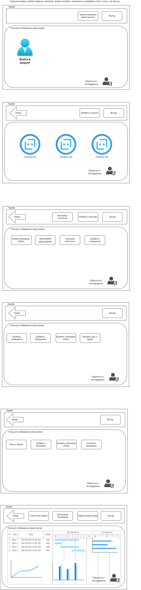
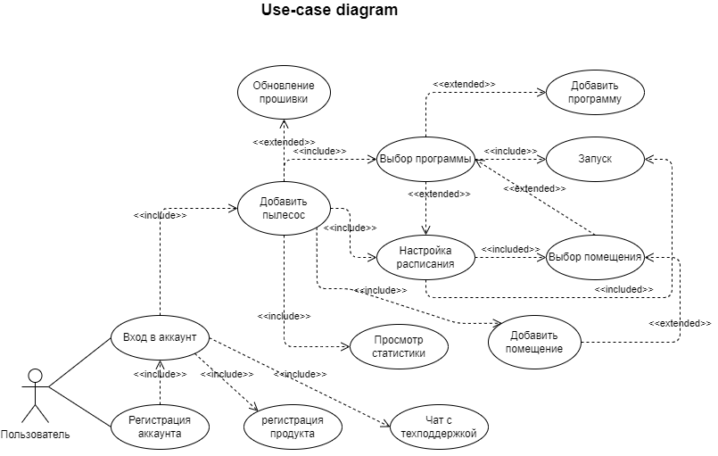
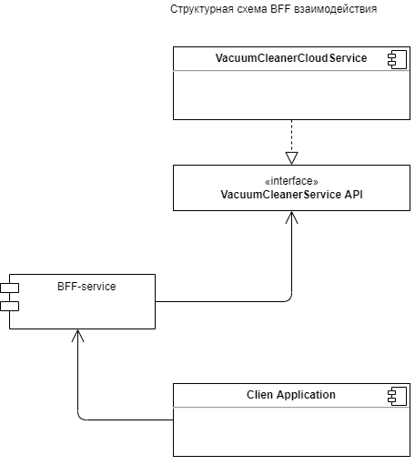
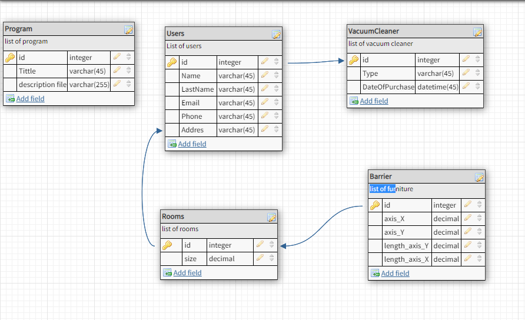

# Спроектировать облачное приложение с интерфейсами в браузере и нативными интерфейсами в мобильных устройствах

+ Необходимо спроектировать облачный сервис домашнего робота пылесоса для уборки помещений.

+ Результатом должны быть:

        - компоненты интерфейсов;
        - доменная модель;
        - Use case;
        - компонентные диаграммы;
        - EDR;
        - API контракты;
        - тестовые сценарии;

# Блок 1 (семинар 10)

## **Задание:**

### a. Спроектировать пользовательский интерфейс (web-SPA, native mobile), основные компоненты (подключение робота, управление помещениями, расписание работы, сервисное обслуживание робота, история уборок), [https://www.figma.com/](https://www.figma.com/)  или [https://app.diagrams.net/](https://app.diagrams.net/)

Нарисуем примерную компоновку сайта, укажем необходимые компоненты интерфейса в первом приближении:

Таким образом, нам потребуются следующие компоненты для воплощения интерфейса пользователя:

компонент "Кнопка";
компонент "Плитка";
компонент "Элемент навигации";
компонент "Превью";
компонент "Контент";

Для такой компоновки подходит вариант SPA приложения, то есть одностраничного приложения. Обновлятся при этом будет только часть страницы "Поле для отображения результатов". Так как данное поле достаточно насыщенно разного рода информацией, рендеринг страницы возложим на сервер, в предположении, что сервер у предприятия выделенный. То есть сборка пользовательского интерфейса производится по модели SSR, то есть на стороне сервера, это позволит грузить странички быстрее.

Итог: архитектура SPA, SSR.

### b. Спроектировать доменную модель, в виде текста Домен – атрибуты

Предметная область - уборка. Контекст - облачный сервис.

Назначение облачного сервиса для домашнего пылесоса:

+ удаленно отслеживать состояние уборки, удаленно контролировать состояние пылесоса, удаленно отдавать команды на начало и конец уборки, удаленно изменять/составлять расписание уборки;

+ предоставлять пользователю возможность регистрации посредством личного кабинета, сохранение в личном кабинете индивидуальных программ уборки и настроек;

+ предоставлять пользователю возможность регистрации продукта(пылесоса), получения технической поддержки, обновление микропрограммы пылесоса, возможность получения информации о сервисных услугах;

|Домен: | Атрибут:|
-----|-----
состояние: | уборка, местоположение, заполнение мусорного отсека, остаток заряда аккумулятора, текущая программа уборки, текущая дата, текущее время, отмена текущей программы уборки, выбор программы уборки;
Уборка: | номер программы уборки, идентификатор уборки в расписании, процент завершения текущей программы уборки, изменение программы уборки, результат завершения уборки (успешно/не успешно);
Расписание: | Дата, время, текущий идентификатор уборки, номер программы уборки, внесение нового иденификатора, удаление существующего идентификатора;
Хранилище расписаний: | идентификатор уборки, программа уборки, дата, время;
Карта помещений: | номер строки, номер столбца, состояние (1/0), добавить столбец, добавить строку, добавить препятствие, удалить препятствие;
Хранилище статистики: | дата уборки, время уборки, результат завершения, процент заполнения мусорного отсека, расход заряда;

### c. Спроектировать сценарии(Use case) - (подключение, выбор помещения, программы уборки, настройка расписания, просмотр статистики..), в виде Актор – Прецедент (из первой лекции)

### d. Спроектировать слой  API Gateway (mobile, web), сформировать REST запросы: GET, POST, PUT, DELETE ([https://swagger.io](https://swagger.io/))

[documentation](index.html)

### * (дополнительно, по желанию) Разработать REST контракты API между компонентами и сгенерировавать (автоматически на ресурсе [https://swagger.io](https://swagger.io/)) код на разных языках программирования

### e. Спроектировать компоненты бизнес-логики и связать их API Gateway с применением паттерна BFF [https://app.diagrams.net/](https://app.diagrams.net/)

### f. Определить состав информации для кеширования на уровне приложения пользователя, API Gateway, уровня бизнес-логики и уровня репозитория. Список

На уровне приложения пользователя будем кэшировать:
1. прогресс выполнения программы;
2. состояние заряда аккумулятора;
3. заполнение контейнера;
4. писать логи сбоев и ошибок;

На уровне API Gateway:
1. команды и транзакции;
2. передаваемые файлы;
3. ссылки изапросы;

На уровне бизнес логики приложения:
1. Картинки и формы;
2. Запросы и транзакции;
3. Ответы от сервера;
4. По выбору пользователя информация об авторизации;

На уровне репозитория:
1. Транзакции и запросы;
2. Часто используемые поля;

### g. Спроектировать ER модель ([https://www.dbdesigner.net/](https://www.dbdesigner.net/)), запросы в БД и уровень хранения данных (СУБД)

