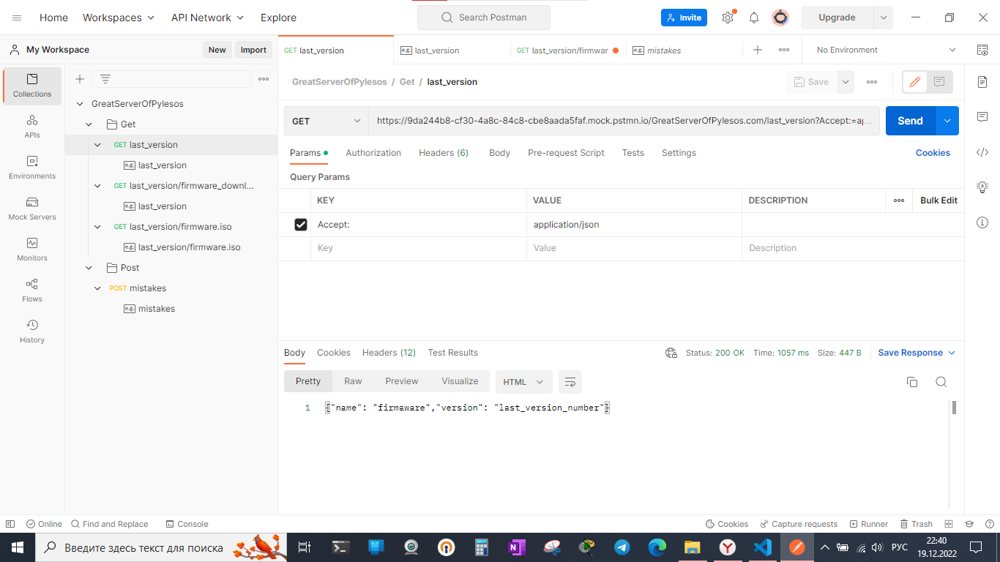
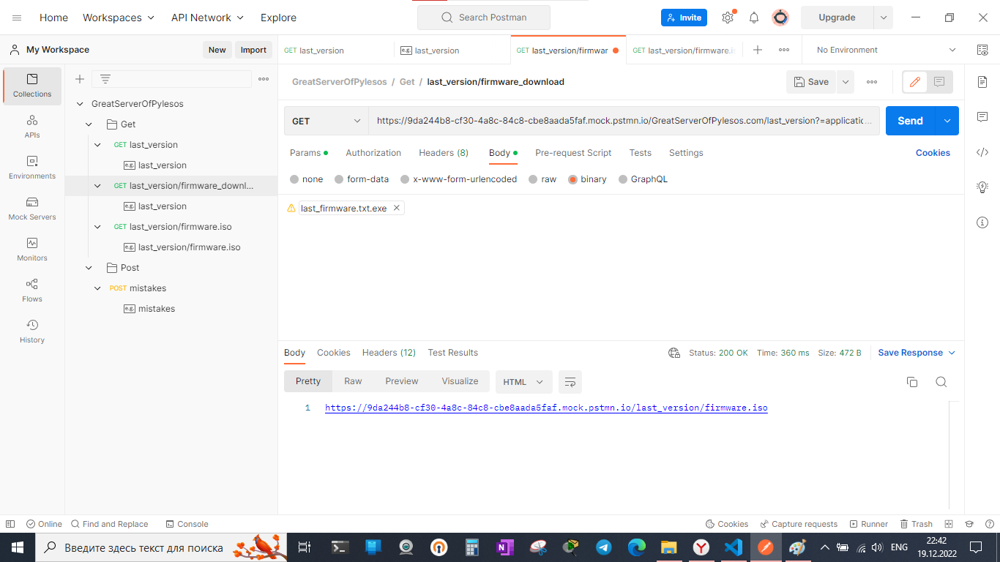
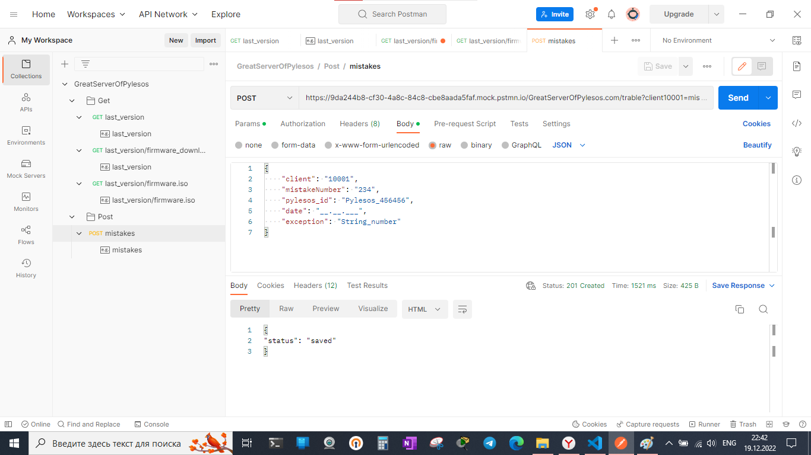
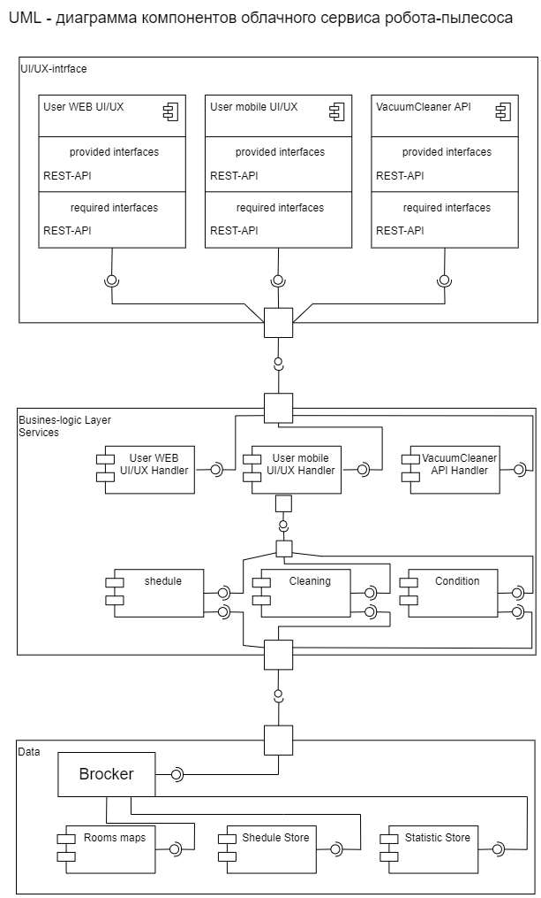
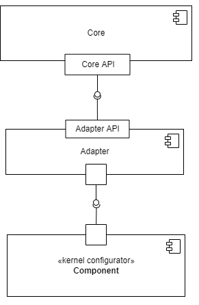

# Спроектировать облачное приложение с интерфейсами в браузере и нативными интерфейсами в мобильных устройствах

+ Необходимо спроектировать облачный сервис домашнего робота пылесоса для уборки помещений.

+ Результатом должны быть:

        - компоненты интерфейсов;
        - доменная модель;
        - Use case;
        - компонентные диаграммы;
        - EDR;
        - API контракты;
        - тестовые сценарии;

# Блок 2 (семинар 11)

## Задание

### h. Спроектировать компонент подключения по API к производителю роботов-пылесосов, для обновления прошивок и передачи диагностических данных <https://app.diagrams.net/>

В данном кейсе клиентским приложением выступает микропрограмма робота-пылесоса. Робот имеет микропрограмму, при включении запускается тест самодиагностики, который проверяет исправность всех подсистем. Далее передается управление загрузчику операционной системы робота-пылесоса. Который загружает операционную систему. Операционная система управляет функциями пылесоса, в числе которой есть функция обновления прошивки (микропрограммы) пылесоса. Данная функция может запускаться по расписанию по умолчанию, через периоды установленные производителем, либо через периоды установленные пользователем, либо быть им отключена.

Соответственно, данная функция также должна иметь интерфейс для взаимодействия с пользователем - через веб-интерфейс личного кабинета.

При наступлении времени обновления, данная функция проверяет номер прошивки пылесоса, формирует REST запрос на сервер, в котором запрашивает версию последней прошивки. Сформируем запросы от пылесоса к серверу и ответы от сервера в формате REST-API. Для моделирования ответов сервера на запросы будем использовать программу Postman:

GET <https://GreatServerOfPylesos.com/last_version?Accept:=application/json>

Сервер направляет статус 200 - ок! И json - ответ:

{
    "name": "firmaware",
    "version": "last_version_number"
}

пылесос сверяет версию прошивки с текущей и, в случае если требуется обновление, отправляет новый Get-запрос на скачивание файла прошивки. После скачивания, запускает процедуру установки программного обеспечения.

GET <https://GreatServerOfPylesos.com/last_version?=application/octet-stream>

Сервер в ответ направляет статус 200 - ок! и присылает ссылку для скачивания прошивки:

<https://GreatServerOfPylesos.com/last_version/firmware.iso>

Пылесос скачивает по ссылке новый файл прошивку в свою память.

В случае наступления ошибки или сбоя в работе пылесос отправляет POST-сообщение с данными диагностики.

POST <https://GreatServerOfPylesos.com/trable?client10001=mistake>

{
    "client": "10001",
    "mistakeNumber": "234",
    "pylesos_id": "Pylesos_456456",
    "date": "__.__.___",
    "exception": "String_number"
}

Сервер присылает ответ 200 - ок! и файлик с ответом

{
    "status": "saved"
}

Сервер - сервер производителя пылесоса.

### i. Спроектировать адаптеры интерфейсов в виде компонент (подключение к БД, шлюзы к интерфейсу, шлюзы к третьим источникам) <https://app.diagrams.net/>

Компонент - это логически законченная функциональная единица (или примитив - т.е. выполняет простейшие не интегрированные функции), которая может быть многократно использована как часть более крупной системы, подключаемая к ней при помощи интерфейса этой функциональной единицы. Адаптер интерфейсов это компонент, который позволяет трансформировать запросы и результаты работы одних классов, предоставляемых их интерфесами в другую форму, позволяющую работать с этими данными другим классам, через их интерфейсы. Ядро системы - бизнес логика, имеет интерфейс/интерфейсы для подключения к ней через адаптеры различных клиентов и сервисов.

### j. Спроектировать компонент внешнего конфигурирования для настройки компонент бизнес-логики (параметры конкретного робота) <https://app.diagrams.net/>. - т.е. по сути сервис, подключаемый к ядру через адаптер его интерфейса, который работает с ядром через интерфейс ядра

### k. Спроектировать и имплементировать(реализовать) компонент самодиагностики (Self-checking), который собирает статус работоспоспособности и времени запроса на каждый компонент уровня API Gateway*, бизнес-логики и слоя управления данными. Включая технологический интерфейс для мониторинга <https://grafana.com/> или <https://prometheus.io/>

Для мониторинга необходимо реализовать схему:
1. Для каждого компонента уровня API Gateway, бизнес-логики и слоя управления данными проектируется модуль, собирающий метрики работы данного компонента.
2. Компонент диагностики - база данных временных рядов Prometheus, собирает метрики из необходимых сервисов и сохраняет их в слое данных. (https://habr.com/ru/company/southbridge/blog/455290/)
3. Компонент Grafana отображает данные из Prometheus в виде графиков и диаграмм, организованных в дашборды.
(https://habr.com/ru/post/652185/)

Что такое базы данных временных рядов?
Базы данных временных рядов, как указано в их названии, представляют собой системы баз данных, специально разработанные для обработки данных, связанных со временем.

Реляционными базами данных состоят из таблиц, которые содержат столбцы и строки, каждая из которых определяет запись в вашей таблице. Базы данных временных рядов работают по-другому. Данные по-прежнему хранятся в "коллекциях", но эти коллекции имеют общий знаменатель: они агрегируются с течением времени. По сути, это означает, что для каждой точки, которую вы можете сохранить, у вас есть временная метка, связанная с ней. Зачем нам нужны базы данных временных рядов?Три слова: быстрая скорость приема. Системы баз данных временных рядов построены на основе предиката, необходимого для быстрого и эффективного приема данных.

Но Prometheus — не просто база данных временных рядов. К нему можно присоединить целую экосистему инструментов, чтобы расширить функционал. Prometheus мониторит самые разные системы: серверы, базы данных, отдельные виртуальные машины, да почти что угодно. Для этого Prometheus периодически скрейпит свои целевые объекты. Что такое скрейпинг? Prometheus извлекает метрики через HTTP-вызовы к определенным конечным точкам, указанным в конфигурации Prometheus.

*шлюз - сервис принимающий запросы из одного места и дробящий их для отправки многим серфисам для исполнения, после получения ответа, формирует из многих ответов один и отправляет его клиенту

### l. Выбрать метрики для наблюдения за инфраструктурой на которой будет развёрнуто решение (процессор, память, диск)

Метрики для тестирования производительности:

1. Потребление ресурсов центрального процессора (CPU, %)

2. Потребление оперативной памяти (Memory usage, Mb)

3. Потребление сетевых ресурсов

4. Работа с дисковой подсистемой (I/O Wait)

5. Время выполнения запроса (request response time, ms)
