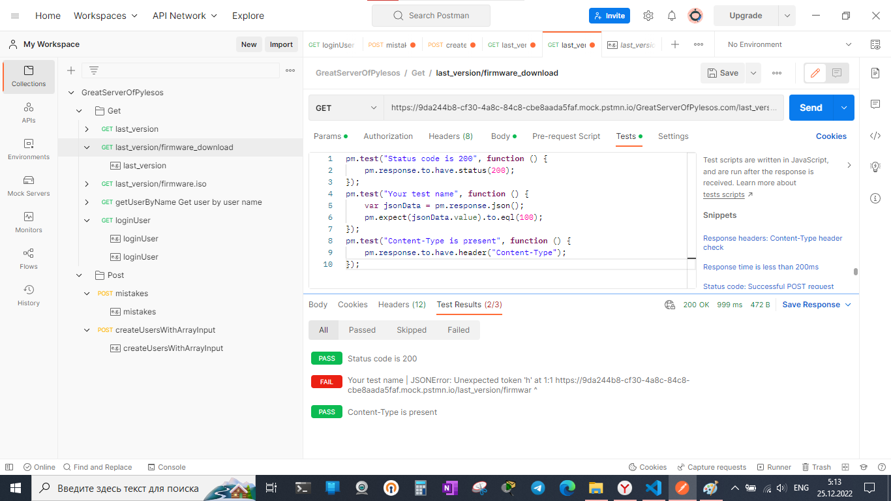

# Спроектировать облачное приложение с интерфейсами в браузере и нативными интерфейсами в мобильных устройствах

+ Необходимо спроектировать облачный сервис домашнего робота пылесоса для уборки помещений.

+ Результатом должны быть:

        - компоненты интерфейсов;
        - доменная модель;
        - Use case;
        - компонентные диаграммы;
        - EDR;
        - API контракты;
        - тестовые сценарии;

# Блок 3 (семинар 12)

## Задание

m. Разработать Unit Test для сервисов бизнес-логики.

Модульное тестирование (unit testing) — тесты, задача которых проверить каждый модуль системы по отдельности. Вся конфигурация системы, включая периферийные исполнительные устройства изображена на рисунке:

Так как для всей системы модульные тесты должны разрабатываться на каждом этапе проектирования, то их должно быть много. В рамках задания необходимо было спроектировать только облачный сервис, поэтому были разработаны автоматические тесты для тестирования API, сгенерированного при помощи Swagger:

**[Тесты](test/java/io/swagger/client/api)**

n. Предложить и разработать E2E (сквозное тестирование) тесты <https://www.postman.com/> или аналоги.

[тестирование при помощи Postman](https://gb.ru/posts/kak-testirovat-api-ili-postman-dlya-chajnikov)

[Гайд по тестированию при помощи Postman](https://testengineer.ru/gajd-po-testirovaniyu-v-postman/)

Сквозное тестирование — это процесс проверки программной системы вместе с ее подсистемами. Самая большая трудность при этом типе тестирования состоит в том, что необходимо располагать достаточным количеством информации о всей системе, а также о взаимосвязанных подсистемах.

|Сквозное тестирование | Системное тестирование|
-----|-----
Проверяет программную систему, а также взаимосвязанные подсистемы. | Проверяет только программную систему в соответствии со спецификациями требований.
Проверяет весь сквозной поток процессов. | Проверяет функциональные возможности и функции системы.
Для тестирования рассматриваются все интерфейсы и серверные системы. | Рассматриваются функциональное и нефункциональное тестирование
Выполняется после завершения тестирования системы. | Выполняется после интеграционного тестирования.
Сквозное тестирование включает в себя проверку внешних интерфейсов, которую сложно автоматизировать. Следовательно, ручное тестирование предпочтительнее. | Для тестирования системы можно выполнять как ручное, так и автоматизированное тестирование.

UI — тесты, которые проверяют работу пользовательского интерфейса. Они затрагивают логику на всех уровнях приложения, из-за чего их еще называют сквозными. Их как правило в разы меньше, так они наиболее тяжеловесны и должны проверять самые необходимые (используемые) пути.

В рамках задания, выполним тестирование ранее разработанных REST запросов на локально установленном сервере Postman:

o. Предложить и разработать приёмочные тесты (UAT) для сценариев Use case <https://www.gurock.com/testrail/> или аналоги.

UAT необходим для того, чтобы: понять, как ведет себя продукт в реальных условиях соответствует ли результат изначальным планам выявить, были ли добавлены все возможно необходимые функции проверить, есть ли ошибки, которые будут мешать пользователю

UAT тестирование делится на виды:

**Альфа/бета-тестирование.** На этапе альфа-тестирования вместо пользователей продукт тестируют сотрудники и другие приближенные к проекту люди. Бета-тест является следующим шагом, когда для проверки собирается группа потенциальных клиентов. Например, когда разработчики игр рассылают приглашения на тематические ресурсы, чтобы набрать людей. 

**Контрактное приемочное тестирование.** Используется для проверки: соответствует ли проект всем требованиям соглашения, установленного между участниками контракта. Чаще всего процесс необходим при работе с наемной командой разработчиков. Заказчику нужно убедиться, что подрядчик реализовал все задачи.

**Законодательное приемочное тестирование.** Помогает удостовериться в том, что продукт не нарушает законы и соответствует всем нормам в пределах конкретной отрасли. Чаще всего подобная проверка необходима для проектов в сфере здравоохранения и финансов.

**Операционное приемочное тестирование.** Определяет эффективность процессов, которые происходят вне видимости клиента (внутри компании), но необходимы для реализации всех функций продукта. Этот тип помогает проанализировать сбор данных, защитные системы и так далее.

**Тестирование по стратегии черного ящика.** Предназначен для изучения причинно-следственной связи между пользовательским взаимодействием с продуктом и результатом, который получается за счет этого. На этом этапе людям объясняют, для чего предназначен продукт, но как именно он работает они изучают самостоятельно.

Как провести пользовательское приемочное тестирование?

Необходимо подготовить план тестовых работ и ознакомить с ним каждую из сторон, включая команду разработчиков. Нужно указать детали, сроки и цели тестирования, затем собрать конференцию с участниками, чтобы выделить основные моменты.

Данные
Всю информацию для теста необходимо подготовить заранее, чтобы у пользователей не возникало проблем. В работе могут понадобится объемные таблицы данных, описание параметров и прочее.

Настройка тестируемой среды
В процессе проверок необходимо подготовить среду для тестирования: инсталлировать программное обеспечение установить вспомогательные надстройки настроить программу и доступ к ней Во время тестов может понадобится периодически возвращать продукт в исходное состояние. Для того чтобы с этим не возникало проблем, пользователям необходимо предоставить инструкции.

Документация, инструкции
У пользователей являющихся бета-тестерами обязательно должен быть доступ к информации о требованиях к системе, а также все сопроводительные бумаги (вплоть до «help»). Исходная информация позволит команде находить неточности и ошибки.

Контакты для сопровождения
Пользователям необходимо дать контакты лиц, ответственных за поддержку. Если они найдут ошибку или неточность, то должны знать, к кому им обращаться. Участникам тестирования следует объяснить, кто ответственен за: координацию проведения тестов требования к продуктам технические моменты, связанные с программным обеспечением вопросы по тестированию права, доступы, аккаунты установку ПО и настройку тестируемой среды

Отслеживание статуса
Нужно дать пользователям информацию о статусе тестирования: какие работы были проделаны, где будут задержки, какие ошибки выявлены. Так им проще будет оценить общую картину и понять поставленную перед ними задачу.

Отчет и итоги пользовательского тестирования
Пользователям являющимся бета-тестерами необходимо предоставить финальный отчёт по завершению тестирования. Он должен показать, на что повлияла работа. В отчёте обычно отражено следующее: какие проблемы были выявлены, их оценка планы по исправлению недочетов этапы планируемой оптимизации и будущих тестов результат приема работы и последующие шаги: будет ли одобрена версия для выпуска, планируется ли доработка

Дополнительное общение с пользователями
Следует наладить неформальное общение с участниками процесса. Это могут быть звонки с вопросами о том, как идет работа, есть ли трудности и даже простое «как дела». Так проще выявить проблемные места и держать “руку на пульсе”.

В рамках выполнения задания разработаем сценарии приемочных тестов для разработанной ранее Use-Case диаграммы. С помощью сервиса <https://www.gurock.com/testrail/>, создадим демонстрационный сервер:

для тестирования разработанных тестовых кейсов, разделенных на три секции:

Для организации работы по тестированию с помощью данного сервиса, желательно интегрировать его с инструментом, позволяющим организовывать и отслеживать работу команды по тестированию. Например Trello или Jira. В этом случае все тестовые кейсы можно организовать внутри единого пространства, прогресс тестирования можно отслеживать удаленно, и результаты тестирования вместе с отчетами будут доступны через эти сервисы всем членам команды автоматически.

Примеры прогресса процесса тестирования и отчетов по тестированию кейсов:

p. Предложить тесты для регрессионного тестирования

Регрессионое тестирование - тестирование, которое используется для проверки того, не влияют ли добавленные инструменты или исправления на существующий функционал приложения и не появляются ли старые ошибки.

Для этого необходимо провести модульное тестирование новых инструментов и модулей, после внедрения их в программу, необходимо провести интеграционное и сквозное тестирование.
